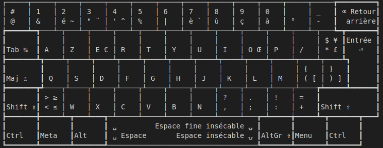

### A specific keyboard mapping for Linux.

┌─────┬─────┬─────┬─────┬─────┬─────┬─────┬─────┬─────┬─────┬─────┬─────┬─────┲━━━━━━━━━┓
│ #   │ 1   │ 2   │ 3   │ 4   │ 5   │ 6   │ 7   │ 8   │ 9   │ 0   │     │ _   ┃ ⌫ Retour┃
│ @   │ &   │ é ~ │ " ¨ │ ' ^ │ %   │ |   │ è ` │ ù   │ ç   │ à   │ °   │ -   ┃  arrière┃
┢━━━━━┷━┱───┴─┬───┴─┬───┴─┬───┴─┬───┴─┬───┴─┬───┴─┬───┴─┬───┴─┬───┴─┬───┴─┬───┺━┳━━━━━━━┫
┃       ┃     │     │     │     │     │     │     │     │     │     │     │ $ ¥ ┃Entrée ┃
┃Tab ↹  ┃ A   │ Z   │ E € │ R   │ T   │ Y   │ U   │ I   │ O Œ │ P   │ /   │ * £ ┃   ⏎   ┃
┣━━━━━━━┻┱────┴┬────┴┬────┴┬────┴┬────┴┬────┴┬────┴┬────┴┬────┴┬────┴┬────┴┬────┺┓      ┃
┃        ┃     │     │     │     │     │     │     │     │     │     │ {   │ }   ┃      ┃
┃Maj ⇬   ┃ Q   │ S   │ D   │ F   │ G   │ H   │ J   │ K   │ L   │ M   │ ( [ │ ) ] ┃      ┃
┣━━━━━━━┳┹────┬┴────┬┴────┬┴────┬┴────┬┴────┬┴────┬┴────┬┴────┬┴────┬┴────┲┷━━━━━┻━━━━━━┫
┃       ┃ > ≥ │     │     │     │     │     │     │ ?   │ .   │ !   │ =   ┃             ┃
┃Shift ⇧┃ < ≤ │ W   │ X   │ C   │ V   │ B   │ N   │ ,   │ ;   │ :   │ +   ┃Shift ⇧      ┃
┣━━━━━━━╋━━━━━┷━┳━━━┷━━━┱─┴─────┴─────┴─────┴─────┴─────┴───┲━┷━━━━━╈━━━━━┻━┳━━━━━━━┳━━━┛
┃       ┃       ┃       ┃ ␣         Espace fine insécable ⍽ ┃       ┃       ┃       ┃
┃Ctrl   ┃Meta   ┃Alt    ┃ ␣ Espace       Espace insécable ⍽ ┃AltGr ⇮┃Menu   ┃Ctrl   ┃
┗━━━━━━━┻━━━━━━━┻━━━━━━━┹───────────────────────────────────┺━━━━━━━┻━━━━━━━┻━━━━━━━┛
